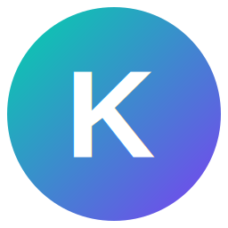

# 🚀 Krigzis - Gerenciador de Tarefas Avançado

<div align="center">



**Gerenciador de tarefas moderno com Timer Pomodoro, Sistema de Notas e Assistente IA**

[](https://github.com/PauloHYBEX/krigzis/releases)
[](LICENSE)
[](#)
[](https://www.electronjs.org/)
[](https://reactjs.org/)
[](https://www.typescriptlang.org/)

[📥 Download](#-download) • [✨ Funcionalidades](#-funcionalidades) • [🚀 Instalação](#-instalação) • [📖 Documentação](#-documentação) • [🤝 Contribuição](#-contribuição)

</div>

---

## 📋 Sobre o Projeto

O **Krigzis** é um gerenciador de tarefas avançado desenvolvido com tecnologias modernas, oferecendo uma experiência completa para organização pessoal e produtividade. Combina gestão de tarefas, timer Pomodoro, sistema de notas e assistente IA em uma interface elegante e intuitiva.

### 🎯 Principais Diferenciais

- **🎨 Interface Moderna**: Design dark com gradientes personalizados
- **⚡ Performance Otimizada**: Construído com Electron e React
- **🔒 Dados Locais**: Banco de dados local para máxima privacidade
- **🤖 IA Integrada**: Assistente inteligente configurável
- **📱 Responsivo**: Interface adaptável para diferentes resoluções
- **🔄 Auto-atualização**: Sistema automático de verificação de atualizações

---

## ✨ Funcionalidades

### 📝 **Gerenciamento de Tarefas**
- ✅ Criação e edição avançada de tarefas
- 🏷️ Sistema de categorias personalizáveis
- 🎯 Níveis de prioridade (Baixa, Média, Alta, Crítica)
- 📊 Status de progresso (Backlog, Esta Semana, Hoje, Concluído)
- 🔗 Vinculação com notas
- 📈 Estatísticas e métricas detalhadas

### ⏰ **Timer Pomodoro**
- ⏱️ Timer personalizável (trabalho, pausa curta, pausa longa)
- 🔔 Notificações automáticas
- 📊 Histórico de sessões
- 🎯 Integração com tarefas
- ⚙️ Configurações avançadas

### 📓 **Sistema de Notas**
- 📝 Editor rico de texto
- 🏷️ Sistema de tags
- 🎨 Cores personalizáveis
- 🔗 Vinculação com tarefas
- 🔍 Busca avançada

### 🤖 **Assistente IA**
- 💬 Chat inteligente
- ⚙️ Configuração de modelos (OpenAI, Anthropic, local)
- 🔧 Ajuda contextual
- 📋 Sugestões de produtividade

### 📊 **Relatórios e Análises**
- 📈 Gráficos de produtividade
- 📊 Estatísticas de tempo
- 🎯 Métricas de conclusão
- 📅 Relatórios periódicos

### ⚙️ **Configurações Avançadas**
- 🌙 Tema escuro forçado
- 🔔 Configurações de notificações
- 💾 Backup e restauração
- 🔄 Sincronização de dados
- 🌐 Configurações de idioma

---

## 📥 Download

### 📦 **Versão Portável (Recomendada)**

**[⬇️ Krigzis v1.0.0 - Windows Portable](https://github.com/PauloHYBEX/krigzis/releases/latest)**

- ✅ **Sem instalação necessária**
- ✅ **Não requer privilégios de administrador**
- ✅ **Auto-instala dependências**
- ✅ **Todas as funcionalidades incluídas**

### 📋 **Requisitos do Sistema**

- **SO:** Windows 10 ou superior (x64)
- **RAM:** 4GB mínimo (8GB recomendado)
- **Espaço:** 200MB para aplicação + dados
- **Internet:** Para atualizações e IA (opcional)

---

## 🚀 Instalação

### 🎯 **Método Rápido**

1. **📥 Baixe** o arquivo `Krigzis-v1.0.0-Windows-Portable.zip`
2. **📂 Extraia** para qualquer pasta de sua escolha
3. **▶️ Execute** `start.bat`
4. **⏳ Aguarde** a instalação automática das dependências
5. **🎉 Pronto!** A aplicação será iniciada automaticamente

### 🔧 **Método Manual** (Para desenvolvedores)

```bash
# Clone o repositório
git clone https://github.com/PauloHYBEX/krigzis.git
cd krigzis

# Instale as dependências
npm install

# Execute em modo desenvolvimento
npm run dev

# Ou compile para produção
npm run build
npm start
```

---

## 📖 Documentação

### 🎯 **Guia de Início Rápido**

1. **Primeira execução**: Configure suas preferências básicas
2. **Crie categorias**: Organize suas tarefas por projetos/áreas
3. **Adicione tarefas**: Use o modal avançado de criação
4. **Configure IA**: Ative o assistente para ajuda contextual
5. **Use o Timer**: Implemente a técnica Pomodoro

### 📚 **Documentação Completa**

- [📖 Manual do Usuário](docs/user-guide.md)
- [⚙️ Configuração Avançada](docs/advanced-config.md)
- [🤖 Setup do Assistente IA](docs/ai-setup.md)
- [🔧 Troubleshooting](docs/troubleshooting.md)
- [🔄 Sistema de Backup](docs/backup-guide.md)

---

## 🛠️ Tecnologias Utilizadas

<div align="center">

| Frontend | Backend | Build & Deploy |
|----------|---------|----------------|
|  |  |  |
|  |  |  |
|  |  |  |

</div>

### 🏗️ **Arquitetura**

- **Frontend**: React 18+ com TypeScript
- **Desktop**: Electron 26+ com IPC otimizado
- **Estilização**: CSS3 com variáveis customizadas
- **Estado**: Context API + Custom Hooks
- **Banco**: Sistema de memória com persistência JSON
- **Build**: Webpack 5 com otimizações de produção

---

## 🤝 Contribuição

Contribuições são sempre bem-vindas! Aqui está como você pode ajudar:

### 🎯 **Como Contribuir**

1. **🍴 Fork** o projeto
2. **🌿 Crie** uma branch (`git checkout -b feature/AmazingFeature`)
3. **💻 Faça** suas alterações
4. **✅ Teste** tudo funciona
5. **📝 Commit** (`git commit -m 'Add some AmazingFeature'`)
6. **🚀 Push** (`git push origin feature/AmazingFeature`)
7. **📬 Abra** um Pull Request

### 🐛 **Reportar Bugs**

Encontrou um bug? [Abra uma issue](https://github.com/PauloHYBEX/krigzis/issues/new) com:

- 📋 Descrição detalhada
- 🔄 Passos para reproduzir
- 💻 Informações do sistema
- 📸 Screenshots (se aplicável)

### 💡 **Sugerir Funcionalidades**

Tem uma ideia? [Compartilhe conosco](https://github.com/PauloHYBEX/krigzis/discussions) através das Discussions!

---

## 📊 Status do Projeto

### 🎯 **Roadmap v1.x**

- [x] ✅ Sistema de tarefas e categorias
- [x] ✅ Timer Pomodoro integrado
- [x] ✅ Sistema de notas vinculadas
- [x] ✅ Assistente IA configurável
- [x] ✅ Sistema de atualizações
- [x] ✅ Interface responsiva
- [ ] 🔄 Sincronização em nuvem
- [ ] 🔄 Aplicativo mobile companion
- [ ] 🔄 Plugins de terceiros
- [ ] 🔄 Relatórios avançados

### 📈 **Estatísticas**

- **🏆 Versão Atual**: 1.0.0
- **📅 Primeiro Release**: Agosto 2025
- **💻 Plataformas**: Windows (Linux/Mac em breve)
- **🌟 Funcionalidades**: 25+ implementadas

---

## 📄 Licença

Este projeto está licenciado sob a Licença MIT - veja o arquivo [LICENSE](LICENSE) para detalhes.

---

## 🙏 Agradecimentos

- **Electron Team** - Pela fantástica plataforma de desenvolvimento
- **React Team** - Pela biblioteca que tornou tudo possível
- **Lucide Icons** - Pelos ícones elegantes e consistentes
- **OpenAI & Anthropic** - Pelas APIs de IA que potencializam o assistente
- **Comunidade Open Source** - Por todas as bibliotecas e ferramentas utilizadas

---

## 📞 Contato & Suporte

<div align="center">

**Desenvolvido com ❤️ por [Paulo Ricardo](https://github.com/PauloHYBEX)**

[](https://github.com/PauloHYBEX)
[](https://github.com/PauloHYBEX/krigzis/issues)
[](https://github.com/PauloHYBEX/krigzis/discussions)

**🌟 Se o Krigzis te ajudou, considere dar uma estrela no repositório!**

</div>

---

<div align="center">

### 🚀 **[Baixe agora o Krigzis](https://github.com/PauloHYBEX/krigzis/releases/latest) e revolucione sua produtividade!**

</div>