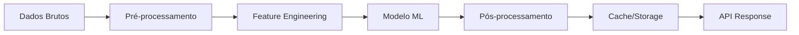

# Arquitetura do Sistema - Task Manager com IA

## 🏗️ Visão Arquitetural

### Padrão Arquitetural: Clean Architecture + Event-Driven
```
┌─────────────────────────────────────────────────────────┐
│                    Presentation Layer                     │
│                  (Electron + React UI)                    │
├─────────────────────────────────────────────────────────┤
│                    Application Layer                      │
│              (Use Cases + Controllers)                    │
├─────────────────────────────────────────────────────────┤
│                     Domain Layer                          │
│              (Entities + Business Rules)                  │
├─────────────────────────────────────────────────────────┤
│                  Infrastructure Layer                     │
│         (Database + AI Services + External APIs)          │
└─────────────────────────────────────────────────────────┘
```

## 🧠 Arquitetura de IA/ML

### Componentes de Machine Learning

#### 1. Motor de Análise Preditiva
```typescript
interface IPredictionEngine {
  predictTaskDuration(task: Task): Promise<DurationPrediction>;
  analyzeProductivityPatterns(userId: string): Promise<ProductivityInsights>;
  suggestOptimalSchedule(tasks: Task[]): Promise<Schedule>;
}
```

#### 2. Sistema de Categorização Automática
```typescript
interface ICategorization {
  categorizeTask(description: string): Promise<Category[]>;
  extractTags(text: string): Promise<string[]>;
  detectPriority(task: Task): Promise<Priority>;
}
```

#### 3. Análise de Sentimento e Contexto
```typescript
interface ISentimentAnalysis {
  analyzeTaskMood(description: string): Promise<Mood>;
  detectStressLevel(tasks: Task[]): Promise<StressLevel>;
  suggestBreaks(workPattern: WorkPattern): Promise<Break[]>;
}
```

### Pipeline de Dados para ML



## 📊 Modelos de Dados

### Entidades Principais

```typescript
// Tarefa com suporte a ML
interface Task {
  id: string;
  title: string;
  description: string;
  status: TaskStatus;
  priority: Priority;
  estimatedDuration?: number;
  actualDuration?: number;
  
  // ML Fields
  predictedDuration?: number;
  confidenceScore?: number;
  suggestedTags?: string[];
  productivityScore?: number;
  
  // Relacionamentos
  listId: string;
  userId: string;
  createdAt: Date;
  updatedAt: Date;
}

// Insights de IA
interface AIInsight {
  id: string;
  type: InsightType;
  title: string;
  description: string;
  recommendations: Recommendation[];
  confidence: number;
  createdAt: Date;
}

// Padrão de Trabalho
interface WorkPattern {
  userId: string;
  averageTaskDuration: number;
  peakProductivityHours: TimeRange[];
  commonBreakPatterns: Break[];
  taskCompletionRate: number;
}
```

## 🔄 Fluxo de Dados com IA

### 1. Criação de Tarefa com IA
```
1. Usuário cria nova tarefa
2. Sistema extrai features do texto
3. IA sugere:
   - Categoria apropriada
   - Tags relevantes
   - Estimativa de tempo
   - Prioridade baseada em contexto
4. Usuário confirma/ajusta sugestões
5. Tarefa é salva com metadata de IA
```

### 2. Monitoramento Contínuo
```
1. Sistema monitora padrões de trabalho
2. A cada N tarefas completadas:
   - Recalcula produtividade
   - Identifica padrões
   - Atualiza modelos locais
3. Gera insights periódicos
4. Sugere otimizações
```

## 🛡️ Segurança e Privacidade com IA

### Princípios de Privacidade
1. **Processamento Local**: Todos os modelos ML rodam localmente
2. **Sem Telemetria**: Nenhum dado é enviado para servidores externos
3. **Criptografia**: Dados sensíveis criptografados com AES-256
4. **Controle do Usuário**: Opção de desabilitar features de IA

### Implementação de Segurança
```typescript
class SecureAIService {
  private encryptionKey: string;
  
  async processData(data: any): Promise<any> {
    const encrypted = await this.encrypt(data);
    const processed = await this.runModel(encrypted);
    return await this.decrypt(processed);
  }
  
  private async encrypt(data: any): Promise<string> {
    // Implementação AES-256
  }
  
  private async decrypt(data: string): Promise<any> {
    // Implementação AES-256
  }
}
```

## 🎯 Métricas de Performance

### KPIs do Sistema
1. **Latência de Predição**: < 100ms
2. **Acurácia de Estimativas**: > 85%
3. **Taxa de Aceitação de Sugestões**: > 70%
4. **Uso de Memória (com ML)**: < 500MB
5. **Tempo de Inicialização**: < 3s

### Monitoramento de Modelos
```typescript
interface ModelMetrics {
  accuracy: number;
  precision: number;
  recall: number;
  f1Score: number;
  latency: number;
  memoryUsage: number;
  lastUpdated: Date;
}
```

## 🔌 APIs Internas

### API de Predição
```typescript
POST /api/predictions/task-duration
{
  "title": "Implementar nova feature",
  "description": "Adicionar sistema de notificações",
  "category": "development",
  "historicalTasks": [...]
}

Response:
{
  "estimatedMinutes": 120,
  "confidence": 0.87,
  "factors": [
    "Complexidade similar a tarefas anteriores",
    "Categoria development tem média de 2h"
  ]
}
```

### API de Insights
```typescript
GET /api/insights/productivity

Response:
{
  "insights": [
    {
      "type": "peak_hours",
      "title": "Você é mais produtivo das 9h às 11h",
      "recommendation": "Agende tarefas complexas neste período"
    },
    {
      "type": "break_pattern",
      "title": "Pausas regulares aumentam sua produtividade",
      "recommendation": "Faça pausas de 10min a cada 90min"
    }
  ]
}
```

## 🧪 Estratégia de Testes para IA

### Níveis de Teste
1. **Testes Unitários**: Funções de processamento de dados
2. **Testes de Integração**: Pipeline completo de ML
3. **Testes de Acurácia**: Validação de predições
4. **Testes de Performance**: Latência e uso de recursos
5. **Testes A/B**: Comparação de modelos

### Framework de Validação
```typescript
class MLTestFramework {
  async validateModel(model: IModel, testData: TestDataset): Promise<ValidationReport> {
    const results = await model.predict(testData.inputs);
    
    return {
      accuracy: this.calculateAccuracy(results, testData.expected),
      confusionMatrix: this.generateConfusionMatrix(results, testData.expected),
      performanceMetrics: await this.measurePerformance(model, testData)
    };
  }
}
```

## 📈 Evolução e Retraining

### Pipeline de Retraining Automático
1. **Coleta de Feedback**: Usuário confirma/corrige predições
2. **Acumulação de Dados**: Armazena localmente até threshold
3. **Retraining Local**: Atualiza modelo com novos dados
4. **Validação**: Testa novo modelo vs. anterior
5. **Deploy Automático**: Se melhor, substitui modelo

### Versionamento de Modelos
```
models/
├── task_duration/
│   ├── v1.0.0/
│   ├── v1.1.0/
│   └── current -> v1.1.0
├── categorization/
│   ├── v1.0.0/
│   └── current -> v1.0.0
└── productivity/
    ├── v1.0.0/
    └── current -> v1.0.0
```

## 🔮 Roadmap de IA

### Fase 1 (MVP)
- Estimativa básica de duração
- Categorização automática
- Insights de produtividade simples

### Fase 2 (3 meses)
- Detecção de padrões complexos
- Sugestões de otimização de agenda
- Análise de sentimento em descrições

### Fase 3 (6 meses)
- Assistente virtual integrado
- Predições multi-variáveis
- Integração com calendário para sugestões contextuais

### Fase 4 (1 ano)
- Processamento de linguagem natural avançado
- Automação inteligente de tarefas
- Colaboração com IA para planejamento

---

**Versão**: 1.0.0
**Última Atualização**: ${new Date().toLocaleDateString('pt-BR')}
**Status**: Aprovado para implementação 